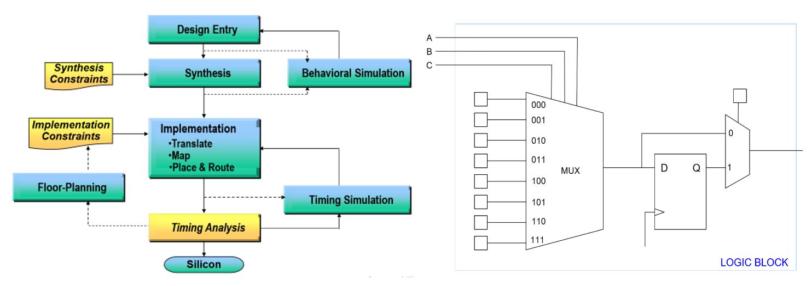
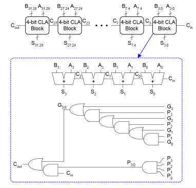

# Hardware Reference

## ASIC vs FPGA vs Processor

|  | ASIC | FPGA | Processor |
| -------- | ---- | ---- | --------- |
| Performance | High | Medium | Low |
| Power Consumption | Low | Medium | High |
| Flexibility | None | Somewhat | General purpose |
| Design Process | Difficult, long | Medium | Easy, quick (software) |
| Cost | Cheaper for large volumes | Cheaper for small volumes | Cheapest (mass-produced) |

## FPGA Design Process

<figure markdown>
  
  <figcaption>(Left) FPGA Design Process; (Right) 3-Input LUT</figcaption>
</figure>

1. **Synthesis:** break logic into LUTs
    - A $n$-input LUT can make any $n$-input function, combinational or sequential
2. **Mapping/placing:** place LUTs into CLBs such that
    - Connected LUTs are close to each other
    - Critical path is approximately minimized
3. **Routing:** connecting logic blocks together
    - Uses programmable switches: NMOS acts as conductor when the configuration bit (part of bitstream) is 1, connecting the tracks
    - Connects CLBs with segments of varying lengths
        - Shorter segments minimize delay, noise, and crosstalk
        - Longer segments have extra capacitance and limited quantity, but minimize the number of segments needed
4. **Timing analysis:** looks for timing violations
    - Path delay is sum of all logic and wire delays

## Memory

- Types: DRAM (volatile, capacitor), SRAM (nonvolatile, cross-coupled inverter), ROM (nonvolatile, read only)

## Caches

- Offer temporal (recently accessed in cache), and spatial (multi-word blocks) locality
    - Instructions more spatial, data can be both
    - To better support temporal: decrease block size and number of sets, increase associativity
        - Block size: number of bytes per cache line
        - Associativity: number of cache lines per set
    - Memory mountains
        - Temporal: levels, based on which level of cache can fully contain the working set
        - Spatial: throughput decreases with increasing stride length until stride length ≥ block size
- Amdahl's law: speed up = $\frac{1}{(1-a) + \frac{a}{k}}$, where $a$ is the percentage of code sped up by $k$ times
    - Increasing associativity decreases conflict misses, but decreases performance (lookup and replacement times)
- Write through is good for synchronization, write back is faster when modifying same cache line multiple times

## Power Optimization

### Types of Power

*Dynamic:* every time a wire is switched from 0 to 1 or 1 to 0, some power is dissipated

$$
P_{dynamic} = \alpha fCV^2
$$

*Static:* every transistor on the chip leaks, even when it is not doing anything

### Power vs Transistor Size

As digital circuits shrink (and chip voltages decrease):

- Dynamic power decreases: $V$ and $C$ decrease in dynamic power equation
- Static power increases: leakage current increases
- Today static power is about as big as dynamic power

### Reducing Power Consumption

- Custom chip
    - Turn off regions that are unused to reduce static power (dark silicon)
    - Multiple threshold libraries
- FPGA
    - Minimize area (less leakage, may allow for smaller FPGA)
- General
    - Lower voltage
    - Revise implementation (add instead of multiply, invert bus)
    - Pipelining: adding flip flops prevents glitches from propagating, which reduces glitch power
        - Disadvantage: flip flops use power, which places extra burden on the clock tree

## Timing

### Gate Delay

- Every wire and transistor has parasitic capacitance (physical property)
- Delay of logic gate is the time it takes to charge the capacitance on its output,
which is the net capacitance of the parasitic capacitances of the wires and transistors
    - Proportional to $RC$ ($nRC$ for $n$ gates, where $n$ is the number of gates in the path)
        - $R$ depends on size of logic gate transistor (bigger → lower $R$) and length of wire (longer → higher $R$)
        - $C$ depends on the same things in the same ways as $R$, but also depends on fanout (larger fanout → higher $C$)
            - Fanout: number of inputs driven by an output
                - Reduce fanout by splitting net, but this increases the number of gates

### Modelling Delays

#### Setup Time

How long input needs to be stable before clock edge to be accepted.

$$
T_{\text{clk}} \geq T_{\text{clk2qMax}} + T_{\text{combinationalMax}} + T_{\text{setup}}
$$

- Setup violation causes metastability
    - Fix by slowing down clock or moving registers around to reduce length of critical path
        - For example, pipelining, which is best when critical path >> other paths)

#### Hold Time

How long input needs to be stable after clock edge to be accepted.

$$
T_{\text{clk2qMin}} + T_{\text{combinationalMin}} \geq T_{\text{hold}}
$$

- Hold time violation causes the loss of data
    - Could be caused by clock skew
    - Fix by increasing gate/DFF delays or adding buffers to data path or earlier clock paths
        - Cannot be fixed by increasing clock period

### Glitches

- Glitch: undesired short-lived pulse that occurs before a signal settles to its intended value
- Caused by unequal arrival times of inputs on combinational gates + same output is generated by different values of state bits
    - Ex 1: XORing the bits 01 → 0, transitioning to 11 or 00 → 1 before settling at 10 → 1
    - Ex 2: clock gating incorrectly such that the output of the AND gate (enable) glitches
        - Clock gating is used to reduce dynamic power
    - Any transition consumes power, so unnecessary transitions consume unnecessary power

#### Glitches in FSMs

Effects

- Edges triggered inputs (i.e. clocks) may be falsely triggered
- Enables may glitch before being sampled, causing garbage to be read
- Hard to detect

Avoiding glitches

- Try to make it so that only 1 input bit changes at a time
- Register next outputs
    - Quick fix, but adds one cycle delay, does not support direct dependence of outputs on inputs, requires extra registers
- Eliminate combinational logic after state machine
    - Move before current state machine or next state machine
- Require outputs to either be:
    - Driven from a state bit or its complement
    - Driven by (simple) combinatorial logic that depends on a single state bit
        - Safest for signals that are constant for the duration of the state machine's operation

### Clock Domain Crossings

- Clock domain: all DFFs in each clock domain run on the same clock
- Signals that cross clock domains will likely cause timing violations
- Asynchronous signals also cause timing violations in a similar manner
- On a timing violation, output may get the right value, wrong value, or become metastable (value between 0 and 1 that resolves randomly)
    - May cause system-wide failure

#### Metastability

If the time it takes for a metastable node to resolve is greater than setup slack (negative slack),
then system-wide failure occurs.

- Quantitately measure with MTBF: average time between two failure-causing instances of metastability

$$
\text{MTBF}(t_{\text{slack}}) = \frac{e^{\frac{t_{\text{slack}}}{C_0}}}{C_1f_{\text{clk}}f_{\text{data}}}
$$

- Increases exponentially with slack
- Maximize by synchronizing asynchronous inputs

### Slack

Time when it actually happens vs when it must happen (positive slack when it happens before must).

- Setup: $T_{\text{required}} - T_{\text{arrival}}$
- Hold: $T_{\text{arrival}} - T_{\text{required}}$
- Required time: clock path
    - Reg2reg and input2reg: $T_{clk} + T_{setup}$
    - Reg2output: unconstrained
- Arrival time: data path
    - Reg2reg and reg2output: $T_{clk2q} + T_{combo}$
    - Input to reg: $T_{combo}$

Reference: [Setup and hold slack](https://asic-soc.blogspot.com/2013/08/setup-and-hold-slack.html)

### Practical Issues

- Retiming in pipelining: move combinational logic from one side of DFF to another to balance the critical path length of each stage
- Clock skew: clock edge arrives at different components at different times (might be due to the difference in path lengths)
    - Implications
        - change in $F_{max}$: changes setup time
        - Failure of design: hold time violations and functional problems losing current value because second clock arrives too late
    - Fix using
        - Buffers
        - H-tree network (route so that same distance to each flop)
        - Global clocks that have dedicated routing to minimize clock skew; however, limited availability
- PLLs: mixed signal circuit that generates output clocks aligned to an input clock
    - Motivation: usually there is clock skew between the input and output clocks of a clock divider/multiplier, and routing a generated clock is unpredictable
    - Can even generate output clocks with the same phase as input clock

## Arithmetic Circuits

### Adders

#### 1-bit adders

- *Half adder:* two 1-bit inputs, 2-bit output
- *Full adder:* half adder + carry in and out

#### Multi-bit adders

There are several types of carry propagate adders:

*Ripple-carry (slow):* chain of full adders that bitwise add N-bit inputs

- Delay: $t_{ripple} \approx Nt_{FA}$, where $t_{FA}$ is the delay of a full adder
    - Proportional to N
- FPGAs are optimized for ripple carry adders, so faster than other implementations with $N ≤ 16$

*Carry select (less slow):* calculate higher-order bits for both cases of carry-in, then select correct case when carry in is available

- Requires more hardware, but slightly faster

*Carry-lookahead (fast):* compute carry out for $k$-bit blocks using generate and propagate signals

- $G_i = A_iB_i$
    - $G_{3:0} = G_3+P_3(G_2+P_2(G_1+P_1G_0))$
- $P_i = A_i+B_i$
    - $P_{3:0} = P_3P_2P_1P_0$
- $C_{out} = G_{in} + P_{in}C_{in}$
- Delay of 4-bit adder: $4 t_{PD}$, where $t_{PD}$ is the delay of a single AND/OR gate
    - All $G,P$ terms available in $t_{PD}$
    - $C$ terms (sum of products) available in $2t_{PD}$
    - Results from full adder (sum, no carry out) available in $t_{PD}$
- Not very scalable, so typical to make a N-bit CLA out of smaller $k$-bit CLAs
    - Delay: $t_{CLA} = t_{pg} + t_{pg\_block} + \frac{N}{k-1}t_{AND\_OR} + kt_{FA}$
        - $t_{pg}$: delay to generate all $G_i,P_i$
        - $t_{pg\_block}$: delay to generate all $G_{i:j},P_{i:j}$ for every $k$-bit CLA
        - $t_{AND\_OR}$: delay from $C_{in}$ to $C_{out}$ of the final AND/OR gate in a $k$-bit CLA
        - $t_{CLA} = 4\log_4(N)t_{PD}$
            - Proportional to $\log N$

    

### Miscellaneous Arithmetic Circuits

- *Subtractor:* take two's complement of second input
- *Equality comparator:* AND all the bitwise XORs
- *Less than comparator:* subtractor; last (sign) bit is 1 when A < B
- *Shift less than:* all 0's, except LSB is result of less than comparator (A < B)
- *Shifters:* arithmetic shifters (`<<<` `>>>`) are the same as logical shifters (`<<` `>>`) except the right arithmetic shift is sign extended
- *Division:* most complex, always use multi-cycle dividers in practice

### Multipliers

Multiplication is a complex operation: avoid if possible

- Add instead of multiply: $7 \times 2 \rightarrow 7 + 7$
- Shift instead of multiply for powers of 2: $7 \times 2 \rightarrow 7 << 2$

*1-bit x N-bit:* AND operation

*N-bit x N-bit:* sum of shifted 1-bit x N-bit for each bit in the second term (long multiplication method)

*Large multiplier:* constructed out of smaller N-bit x N-bit multipliers

- Let $A$ be a $2N$-bit number, with $A_H$ being the upper N bits and $A_L$ being the lower N bits.
Let $B,B_H,B_L$ be defined a similar matter. Therefore,

    $$
    \displaylines{A = A_{2N-1}A_{2N-2}...A_0 = A_H \times 2^N + A_L \\
                  B = B_{2N-1}B_{2N-2}...B_0 = B_H \times 2^N + B_L}
    $$

    - $2^N$ shifts left by N bits

- The product of $A$ and $B$ is

    $$
    A \times B = A_HB_H2^{2N} + (A_HB_L+A_LB_H)2^N + A_LB_L
    $$

    - $2N$-bit x $2N$-bit produces a $4N$-bit result

*Signed multipliers* subtract last number (two's complement) rather than add it

*Serial (multi-cycle) multiplier:*

```
P = 0
while B != 0:
    if B(0) == 1:
        P = P + A
    A = A << 1
    B = B >> 1
```

## Decimal Numbers

### Fixed Point

Like decimal numbers but base 2. For example,

$$
101.01 = 1 \times 2^2 + 0 \times 2^1 + 1 \times 2^0 + 0 \times 2^{-1} + 1 \times 2^{-2} = 5.25
$$

- N-bit representation has $M$ integer bits (left of decimal point) and $N-M$ fraction bits (right of decimal point)
- Arithmetic operations: align decimal then perform as usual
    - Multiplication and division result in loss of precision

### Floating Point

Binary scientific notation:

$$
\pm 1.\text{xxx} \times 2^i \Leftrightarrow \{\text{sign}\}1.\{\text{mantissa}\} \times \{\text{base}\}^{\{\text{exponent}\}}
$$

The floating point representation saves the sign, biased exponent, and mantissa fields of the number in binary scientific notation

- 32-bit representation: 1 sign bit, 8 biased exponent bits, 23 mantissa bits
- 64-bit representation: 1 sign bit, 11 biased exponent bits, 52 mantissa bits
- Bias exponent to be positive to circumvent the need for a signed exponent field
    - Bias is 127 for 32-bit and 1023 for 64-bit
- Range
    - Largest positive: exponent is all 1s except LSB, mantissa is all 1s
    - Smallest positive: exponent is all 0s except LSB, mantissa is all 0s
- Special cases
    - Subnormal (smaller than what is normally possible): exponent all 0s, mantissa is interpreted as being preceded by 0
        - Smallest positive: mantissa is all 0's except LSB

    | Number | Sign | Biased Exponent | Mantissa |
    | ------ | ---- | --------------- | -------- |
    | 0 | X | 00000000 | 00000000000000000000000 |
    | $\infty$ | 0 | 11111111 | 00000000000000000000000 |
    | $-\infty$ | 1 | 11111111 | 00000000000000000000000 |
    | NaN | X | 11111111 | non-zero |

Example: write $-58.25_{10}$ in 32-bit floating point

1. Convert decimal to binary: $58.25_{10} = 111010.01_2$
2. Write in binary scientific notation: $1.1101001 \times 2^5$
3. Fill in the fields
    - Sign bit: $1$ (negative)
    - Biased exponent: $127 + 5 = 132 = 10000100_2$
    - Mantissa: $110 1001 0000 0000 0000 0000_2$

### Fixed vs Floating Point

- Fixed: simpler circuitry, smaller, less power consumption, cheaper
- Floating point: higher dynamic range of representable values
    - Not synthesizable unless explicitly accounted for; useful for simulation

## SystemVerilog

- Types of modules
    - Behavioral: describe what module does (gate level)
    - Structural: describe how it is built from simpler modules (instantiates other modules)
- Unlike regular Verilog, SystemVerilog supports OOP and generate statements
    - Generate statements are for readability; they don’t change hardware implementation

--8<-- "includes/abbreviations.md"
