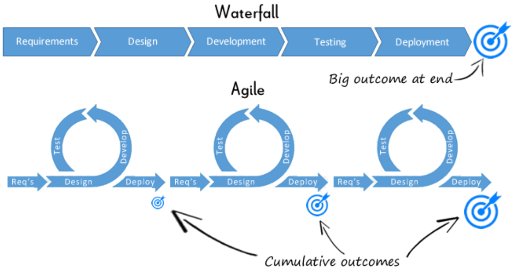

# Software Reference

!!! warning "Disclaimer"
    My software-related interview experiences have largely come from interviews for hardware/embedded positions.
    If you have experience interviewing for software positions and want to contribute, feel free to contact me.

## Concepts

Be able to explain concepts in your own words and give examples of you applying them.

### Agile software development

- Iterative software development
    - Purpose: rapid delivery of high quality software
- Documenting and resolving issues
- Kanban vs Scrum

### Testing

- Test-driven development
- Black vs white box testing
- How to develop a test plan
- Types of tests: unit, integration, functional, regression
- Fault injection
- Corner cases
- Root-cause analysis
- Parts of a good bug report

### DevOps

- CI/CD
- Docker, Kubernetes

--8<-- "includes/abbreviations.md"
