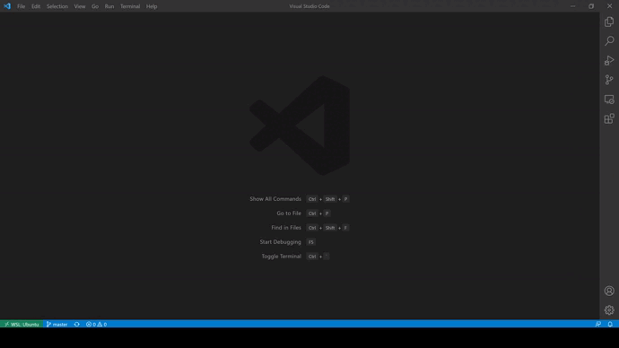

# IDE Setup

## Demo



## Background

> Vim :material-arrow-right: Neovim :material-arrow-right: VS Code

Followed the setup guide in the [Resources](#resources) section.

My IDE of choice starts with Vim. Its main advantages are that it can be run in a terminal and used
without every having to touch the mouse. Once the steep learning curve is overcome, coding becomes
much faster. However Vim is primarily a text editor and does not natively support the features
expected from a full IDE. On the other hand, VS Code supports debugging, remote development, Git,
and much more through extensions.

To get the best of both world's I connect a Vim backend to a VS Code frontend using VS Code's Neovim extension.
Rather than emulating Vim functionality like other extensions do, this extension
communicates with the Neovim executable. The disadvantage of emulation is performance and functionality that is dependent on its developers implementing them.

That is not to say that I don't use Vim/Neovim by itself at all. It is convenient for making small changes to a
file directly in the CLI, and is noticeably faster for large files.

## Learn about Vim and My IDE Setup

1. Recommended Vim video tutorials: [Vim Tutorial](https://www.youtube.com/watch?v=IiwGbcd8S7I&t=1s), [Mastering the Vim Language](https://www.youtube.com/watch?v=wlR5gYd6um0),
[How to Do 90% of What Plugins Do (With Just Vim)](https://www.youtube.com/watch?v=XA2WjJbmmoM&t=734s)
2. The setup guide in the [Resources](#resources) section also demonstrates its capabilities
3. Read the [relevant files in my setup repository](#relevant-files-in-my-setup-repository)

### Quirks

Several quirks that I have noticed with my VS Code configuration:

- ++r++ + ++shift+k++ to replace a character with `K` will not work because ++shift+k++ is used to open the description box
    - Workaround: remap ++shift+k++, or replace in insert mode
- Undo and redo behavior is different in Vim and VS Code. Thus saving a file, making a change, then using ++u++ to undo will not bring the file back to its saved state
    - Workaround: save every time, or map ++u++ and ++ctrl+r++ to the VS Code implementation of undo and redo

## Setup

1. [Install Neovim](https://github.com/neovim/neovim/wiki/Installing-Neovim)

2. Symbolic link `.vimrc` to the home directory in an Administrator PowerShell prompt

    ``` powershell
    New-Item -ItemType Symboliclink -Path "$env:USERPROFILE\.vimrc" -Value "$env:USERPROFILE\Programming\git_projects\.setup\.vimrc"
    ```

3. Make a directory named `nvim` in `$env:LOCALAPPDATA` and symbolic link `init.vim` to it in an Administrator PowerShell prompt

    ``` powershell
    New-Item -ItemType Symboliclink -Path "$env:LOCALAPPDATA\nvim\init.vim" -Value "$env:USERPROFILE\Programming\git_projects\.setup\windows\init.vim"
    ```

4. Install VS Code

    ``` powershell
    winget install --id Microsoft.VisualStudioCode
    ```

5. Install the [VSCode Neovim](https://marketplace.visualstudio.com/items?itemName=asvetliakov.vscode-neovim), [Which Key](https://marketplace.visualstudio.com/items?itemName=VSpaceCode.whichkey),
and [Settings Cycler](https://marketplace.visualstudio.com/items?itemName=hoovercj.vscode-settings-cycler) extensions

    ??? tip "Other useful VS Code extensions"
        | Extension Name | Description |
        | ----------- | ------------------------------------ |
        | Edit csv | View and edit csv files with a table UI |
        | Git History | View git log, file history, compare branches or commits |
        | GitLens | See who commited each line of code and when they did it |
        | Live Share Extension Pack | Real-time collaborative development (like Google Docs for programming) |
        | Peacock | Change workspace border color to be able to quickly identify workspaces |
        | Remote Development | Support for development using WSL, SSH, and Docker |
        | toggle semicolon | ++ctrl+semicolon++ to add or remove the semicolon at the end of a line |
        | vscode-icons | Clean file icons for the file explorer |
        | vscode-pdf | Display pdf file in VS Code |
        | `<language/framework>` Extension Pack | Popular extensions for the other languages and frameworks you use |

### Why symbolic link?

A symbolic link is a file that points to another file.
For example, I want my configuration files (i.e. `$env:USERPROFILE\.vimrc`)
to point to files in my setup repository (i.e. `$env:USERPROFILE\Programming\git_projects\.setup\.vimrc`).
This enables updates I pull for my setup repository to be instantly applied to my setup.
If this functionality does not matter to you, there is no need to symbolic link files.

## Relevant Files in My [Setup Repository](https://github.com/patrick-5546/setup)

- `.vimrc`
- `windows/init.vim`
- `windows/vscode_sample_keybindings.json`
- `windows/vscode_sample_settings.json`

## Resources

- VS Code / Neovim integration setup guide: [VSCode with embedded Neovim](https://www.youtube.com/watch?v=g4dXZ0RQWdw&list=LL&index=9&t=381s)
- [`init.vim` without my changes](https://github.com/LunarVim/LunarVim/blob/rolling/utils/lv-vscode/init.vim)
- [`settings.json` and `keybindings.json` without my changes](https://github.com/LunarVim/LunarVim/tree/rolling/utils/vscode_config)
- Vim configuration: [tylerlum/vim_configuration](https://github.com/tylerlum/vim_configuration), [amix/vimrc](https://github.com/amix/vimrc)
- [Workaround `:number` and `:relativenu` not working in VS Code](https://github.com/asvetliakov/vscode-neovim/issues/175#issuecomment-929630274)

--8<-- "includes/abbreviations.md"
